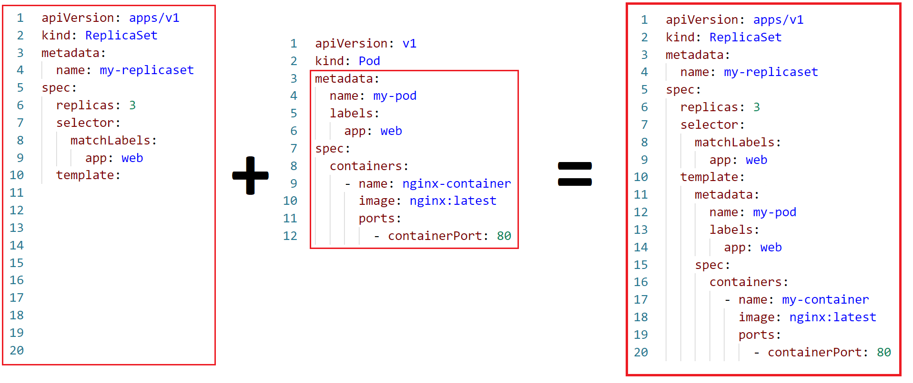

# Creating ReplicaSet



```yaml
apiVersion: apps/v1
kind: ReplicaSet
metadata:
  name: my-replicaset
spec:
  replicas: 3
  selector:
    matchLabels:
      app: web
  template:
    metadata:
      labels:
        app: web
    spec:
      containers:
        - name: my-container
          image: nginx:latest
          ports:
            - containerPort: 80
```

---

## Some Imp Points

#### Rolling Updates

- When **Pod template** or `template` is changed or modified by user of a ReplicaSet and is applied `kubectl apply -f name.yaml`, Kubernetes starts a rolling update:
- **How K8s dose it?**
  - First it creates new **Pods** with the updated `template`, keeping old ones running.
  - Second it slowly replaces the old Pods with new maintaining the desired number of `replicas`.
  - **Rollback**: If issues arise during the update, you can roll back to the previous version, with this command.
    ```bash
    kubectl rollout undo replicaset my-replicaset
    ```
- Checking Update Progress:

  ```bash
  kubectl get replicaset
  ```

---

## Verification Commands:

### 1. Create a ReplicaSet

```bash
kubectl apply -f your-replicaset-config.yaml
```

### 2. Lists all ReplicaSets in cluster

```bash
kubectl get replicaset
```

### 3. Describe a ReplicaSet:

```bash
kubectl describe replicaset your-replicaset-name
```

---

### Scale a ReplicaSet:

```bash
kubectl scale replicaset your-replicaset-name --replicas=5
```

### Delete a ReplicaSet:

```bash
kubectl delete replicaset your-replicaset-name
```

### Update a ReplicaSet (by applying changes to the config):

```bash
kubectl apply -f your-updated-replicaset-config.yaml
```

### Rolling Restart (Update) a ReplicaSet:

```bash
kubectl rollout restart replicaset your-replicaset-name
```

### Rollback a ReplicaSet Update:

```bash
kubectl rollout undo replicaset your-replicaset-name
```

### View ReplicaSet Pods:

```bash
kubectl get pods --selector=your-label-selector
```

### Exec into a ReplicaSet Pod:

```bash
kubectl exec -it your-pod-name -- /bin/bash
```

---
